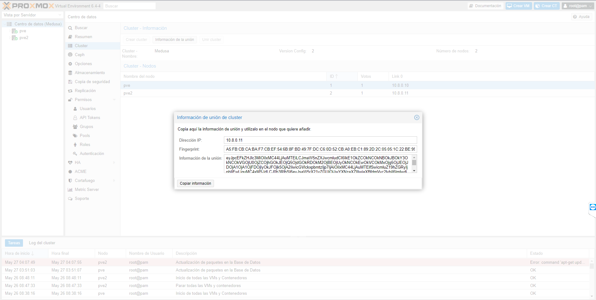

# PROXMOX Virtual Environment


PROXMOX VE “Virtual Environment” es un entorno de virtualización de servidores de código abierto. 
Está en distribuciones GNU/Linux basadas en Debian con una versión modificada del Kernel RHEL (Red Hat Enterprise Linux) y permite el despliegue y la gestión de máquinas virtuales y contenedores. Proxmox VE incluye una consola Web y herramientas de línea de comandos, y proporciona una API REST para herramientas de terceros. Dos tipos de virtualización son compatibles: los contenedores basados con LXC (Linux Containers) y la virtualización con KVM (Kernel-based Virtual Machine). Viene con un instalador e incluye un sitio Web basado en la interfaz de administración.

## Característias principales: 

- **Administrador Web GUI** se basa en el marco de JavaScript ExtJS y puede usarla con cualquier navegador moderno, para configurar los servidores físicos, clusters, máquinas virtuales, respaldos y restauracion, snapshots. No es necesario instalar aplicaciones de terceros.

- **Virtualización para la mayoría de Sistemas Operativos**, en versiones de 32 y 64bits. Linux en todas sus distribuciones, Microsoft desde windows 98 hasta windows 10 y windows server desde 2000 hasta 2019, Solaris, AIX, entre muchos más compatibles con KVM.

- **Máquina virtual basada en kernel** (KVM) es una solución para implementar virtualización sobre Linux.  Puede funcionar en hardware x86/x86_64 y es necesario que el microprocesador tenga soporte de virtualización ya sea Intel VT-x o AMD-V.

- **Virtualización basada en contenedores** (LXC), es una alternativa para ejecutar máquina Linux en espacios separados. A diferencia de la virtualización KVM este funciona como un módulo agregado al servidor físico y hace uso directo del hardware.

- **Los Respaldos** se administran a través de su interfaz Web. Puede efectuar un respaldo de forma inmediata o programado. La restauración es simple, solo debe de seleccionar el backup a restaurar y listo.

- **Las Instantánea en vivo** le permite hacer copias de máquinas Virtuales incluyendo el contenido de la RAM, su configuración y el estado de los discos virtuales. Usted puede retroceder en tiempo la Maquina Virtual restaurando spanshot's.

- **Firewall** es completamente personalizable y permite configuraciones complejas a través de la conosla web o linea de comandos.

- **Alta Disponibilidad** con al menos 3 nodos o equipos con proxmox en cluster, si alguno de los nodos falla, las maquinas virtuales migran en automatico hacia los otros nodos.

- **Migración en vivo y en linea** le permite mover las maquinas virtuales entre nodos sin ningún tiempo de inactividad o efecto perceptible por parte del usuario final, con los recursos en almacenamiento compartido no hay necesidad de mover los discos virtuales.

- **Integración con NAS o SAN** ya sea a través de Fibra Canal, iSCSI Over Ethernet o NFS.

- **Almacenamiento Hiperconvergente** con Ceph o ZFS de facil administración utilizando solo la interfaz web.

## Instalación de Proxmox VE:

Proxmox VE es fácil y rápido de instalar, solo descargando la imagen ISO e iniciar la instalación en su equipo, en cinco minutos comenzará a crear sus primeras máquinas virtuales y/o contenedores. La configuración se realiza fácilmente a través de la interfaz web.


### Hardware mínimo recomendado: 

- Procesador en 64bits (Intel EMT64 ó AMD64), de preferencia con múltiples núcleos
- Tarjeta Madre con soporte para virtualización (Intel VT ó AMD-V)
- 2 GB en RAM, solo servicios PVE.
- Discos duros rápidos (15k rpm SAS, SSD)
- Soporte para RAID por hardware o ZFS
- Tarjetas de red Gbit (Cantidad según la configuración de almacenamiento externo y/o cluster)

Para Ceph o ZFS se requiere memoria adicional, aproximadamente 1 GB de memoria por cada TB utilizada de almacenamiento.

Se debe de sumar RAM de las Maquinas virtuales que se van a crear.

### Pasos a seguir: 

1.- Una vez descargado la ISO de Proxmox es necesario crear una media ejecutable ya sea una USB o CD/DVD para arrancar la instalación en el equipo.


- URL de descarga: https://www.proxmox.com/en/downloads

2.- Dependiendo de la BIOS del servidor, sera necesario realizar los ajustes necesario para que corra la media booteable, ya que puede estar desactivado el Intel VT-x para virtualización,  que ayudan a acelerar aplicaciones de máquina virtual. Una vez iniciada la media comenzamos con el instalador. 

3.- Es necesario especificar la ubicación, disco duro de instalación, datos para la cuenta de administrador y configuración de red. Posteriormente el Instalador terminara la instalación en automatico.

Entramos desde nuestro navegador con: **https://direccion_ip:8006**, iniciamos sesión y nos encontraremos con nuestro menú de Proxmox preparado para virtualizar. 


## **PROYECTO:**
Como propuesta de proyecto vamos montar un cluster con dos nodos que tenga alta disponibilidad. Por falta de recursos se hará todo mediante máquinas virtuales. 

### ESQUEMA DE LA RED

Dentro de el servidor físico, que estará conectada a la red de la empresa, se montará una máqueta que dispondrá de dos Proxmox unidos a un cluster con alta disponibilidad, mediante un servidor NAS que compartirá el almacenamiento de ambos nodos.

Para está máqueta decidí introducirlas en una red aparte para evistar conflicto con las direcciones IP de la empresa además de así tener un orden. 


Para que ambos nodos se comunicasen entre si de manera privada cree un Linux Bridge dentro del servidor físico y cambié los dispositivos en red de estos, además de cambiarlos dentro de los archivos de configuración que está en: **/etc/network/interfaces**. 

> - NOTA: Reiniciar máquinas para que se apliquen los cambios. 


Ahora antes de crear el cluster haremos un snapshot de los nodos para que en caso de fallo, tener la posibilidad de volver atrás. Para ello, el almacenamiento de los nodos tiene que estar en lvmthin. 

> - NOTA: En la práctica tuve problemas a la hora de hacer el snapshot, además de tener que aumentar el espacio, dicho volumen estaba en lvm y tuve que borrar el que había, crear un volumen nuevo y convertirla en lvmthin. Esto se debe a que lvm y lvmthin gestionan la memoria de distinta manera y es necesario para el snapshot. 

-- SOLUCIÓN: 

```
Se crea el volumen con la capacidad que queramos
- lvcreate -L 500G -n data pve

Y seguidamente lo convertimos en lvmthin 
- lvconvert --type thin-pool pve/data
```
Otra alternativa al snapshot es hacer un **backup** de los nodos, pero se tiene que tener en cuenta las diferencias entre ambas dependiendo de lo que necesitemos.

Ya instalado y configurado nuestros nodos comenzamos con la creación del cluster, para ello nos situamos en uno de los dos proxmox que tenemos, nos dirigimos a **Centro de datos > Cluster > Crear** y añadimos el Linux Bridge y le ponemos un nombre.  


Con el cluster creado queda unir el segundo nodo dentro de **Centro de datos > Cluster > Unir**, se pedirán unas credenciales que encontraremos en el nodo donde se ha creado. 


